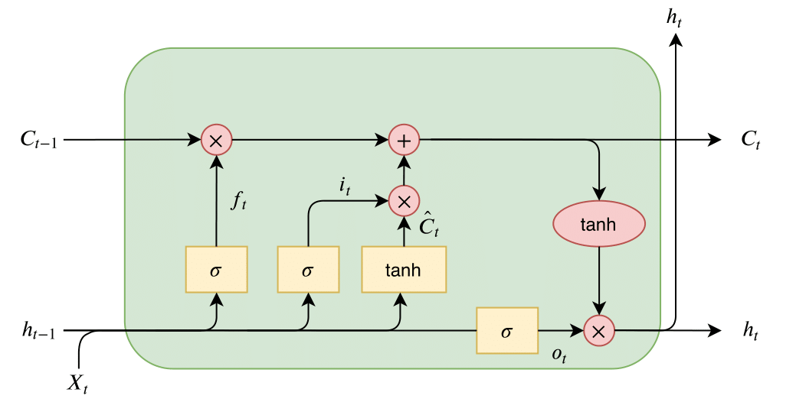

<p align="center">
    
</p>
<h3 align="center">Toxic Comment Classifier</h3>


<!-- TABLE OF CONTENTS -->
<details open="open">
  <summary>Table of Contents</summary>
  <ol>
    <li>
      <a href="#about-the-project">About The Project</a>
      <ul>
        <li><a href="#built-with">Built With</a></li>
      </ul>
    </li>
    <li>
      <a href="#overview">Overview</a>
    </li>
    <li>
      <a href="#getting-started">Getting Started</a>
      <ul>
        <li><a href="#installation-and-requirements">Installation and Requirements</a></li>
      </ul>
    </li>
    <li><a href="#data">Data</a></li>
    <li><a href="#usage">Usage</a></li>
  </ol>
</details>

# About the Project

This repository contains a **Long Short-Term Memory (LSTM)** model that classifies text comments according to multiple toxicity labels:

- `toxic`
- `severe_toxic`
- `obscene`
- `threat`
- `insult`
- `identity_hate`

## Built With

<span></span>

## Overview

The goal is to demonstrate how to build and train an LSTM model to detect and classify toxic comments. The model takes raw text, tokenizes and pads it, then outputs predictions on the six labels above.

Key features:

- **Tokenization**: Convert text into integer sequences  
- **Padding**: Ensure each sequence has a fixed length (250)  
- **Embedding Layer**: Transform word indices into embeddings (size: 128)  
- **LSTM Layer**: Extract sequential features (size: 60)  
- **Global Max Pooling**: Reduce dimensionality  
- **Dropout**: Mitigate overfitting  
- **Dense Layers**: Classify into 6 binary labels using a sigmoid activation  

## Installation and Requirements

1. **Python 3.7+** recommended  
2. Required libraries (install via `conda`):
   ```bash
   conda install numpy pandas matplotlib tensorflow
   ```

## Data
   The data was obtained from [jigsaw toxic classification challenge](https://www.kaggle.com/competitions/jigsaw-toxic-comment-classification-challenge).
    
